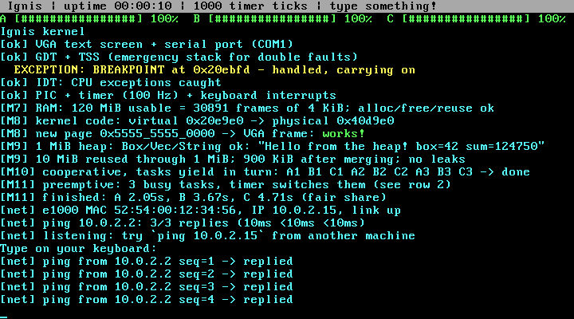
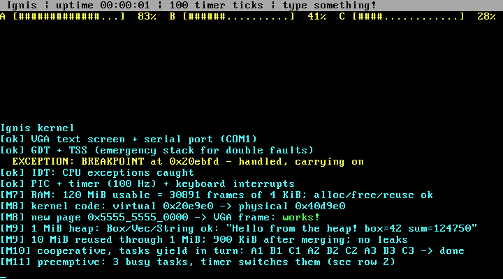
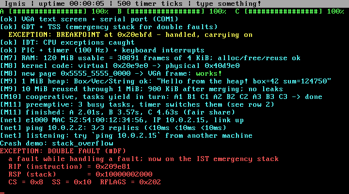

# Ignis

A small x86_64 operating system kernel written from scratch in Rust, as a way to learn how operating systems really work. It boots on bare (virtual) hardware with nothing underneath it, and grows one subsystem at a time: screen, interrupts, memory, multitasking, and finally a network card driver that answers `ping`.

It runs in [QEMU](https://www.qemu.org/). Most hardware-facing pieces are written by hand rather than pulled from crates: the GDT, IDT, page table walker, heap allocator, scheduler, PCI scanner, and the e1000 network driver.



## What it can do

| Area | What's implemented |
|---|---|
| **Boot** | `no_std` / `no_main` kernel for a custom `x86_64` target, booted by the [`bootloader`](https://github.com/rust-osdev/bootloader) crate (0.9) |
| **Output** | VGA text-mode driver (colours, scrolling, hardware cursor, status bar) and a 16550 UART serial driver, so logs show up in your terminal |
| **CPU setup** | Hand-built GDT and TSS, with an emergency stack for double faults |
| **Exceptions** | Hand-built IDT with handlers for divide error, breakpoint, invalid opcode, general protection fault, page fault (with CR2 + decoded error code) and double fault |
| **Interrupts** | 8259 PIC remapping, a PIT timer at 100 Hz, a PS/2 keyboard driver (Shift, Caps Lock, Backspace), deadlock-safe printing |
| **Memory** | Bitmap physical frame allocator built from the bootloader's memory map, a 4-level page table walker and mapper, and a linked-list heap allocator, so `Box`, `Vec` and `String` work |
| **Multitasking** | Tasks with their own stacks, a naked-assembly context switch, a round-robin scheduler, and both cooperative (`yield_now`) and preemptive (timer-driven) switching |
| **Networking** | PCI bus scan, Intel e1000 driver (MMIO, DMA descriptor rings, interrupts), Ethernet, ARP, IPv4 and ICMP echo. Ignis pings QEMU's gateway at boot and replies to incoming pings |

### Multitasking

Three tasks that never yield share the CPU because the timer preempts them 100 times a second. Their progress bars move together even though B has twice A's work and C three times.



### Crash handling

Instead of silently rebooting, the kernel explains what went wrong. Here a deliberate stack overflow hits the guard page, the page fault can't be handled on the full stack, and the double fault handler runs on the TSS emergency stack.



## Running it

### Requirements

- macOS or Linux (developed on an Apple Silicon Mac; QEMU emulates the x86_64 CPU)
- [Rust](https://rustup.rs/). `rust-toolchain.toml` selects the nightly toolchain with its `rust-src` / `llvm-tools-preview` components, and rustup installs them automatically. Nightly changes often, so a future nightly may need small fixes
- QEMU: `brew install qemu` (or your distro's `qemu-system-x86`)
- `bootimage`: `cargo install bootimage`

### Build and run

```bash
cargo run
```

This builds the kernel, glues it to the bootloader into a bootable disk image, and starts QEMU. The QEMU window shows the screen, and your terminal shows the serial log. Click into the window and type. Resize the window to scale the text up.

Every network frame is recorded to `target/net.pcap`:

```bash
tcpdump -r target/net.pcap -nn -e
```

### Crash demos

Pick a deliberate crash at build time to see each exception handler:

```bash
IGNIS_CRASH=page_fault cargo run
```

Options: `divide`, `opcode`, `gpf`, `page_fault`, `stack_overflow`, `oom`.

### Pinging the kernel

**Without root:** `scripts/fake_peer.py` pretends to be a second computer using QEMU's `dgram` backend. It answers the kernel's pings and pings the kernel back, checking every reply:

```bash
python3 scripts/fake_peer.py &
qemu-system-x86_64 -drive format=raw,file=target/x86_64-ignis/debug/bootimage-ignis.bin -serial stdio \
  -netdev dgram,id=net0,local.type=inet,local.host=127.0.0.1,local.port=5555,remote.type=inet,remote.host=127.0.0.1,remote.port=5556 \
  -device e1000,netdev=net0
```

**From macOS itself:** `scripts/ping-from-mac.sh` puts the kernel on a private `vmnet` network with your Mac (needs `sudo`), then in another tab:

```bash
ping 192.168.100.2
```

The kernel's address and the host it pings at boot can be changed at build time with `IGNIS_IP` and `IGNIS_GATEWAY` (defaults `10.0.2.15` and `10.0.2.2`, QEMU's user network).

### Debugging with LLDB

```bash
qemu-system-x86_64 -drive format=raw,file=target/x86_64-ignis/debug/bootimage-ignis.bin -s -S
lldb target/x86_64-ignis/debug/ignis
(lldb) gdb-remote 1234
(lldb) breakpoint set -H -n _start
(lldb) continue
```

## How the code is organised

About 3,000 lines of Rust in `src/`:

| File | Role |
|---|---|
| `main.rs` | Entry point and boot sequence |
| `vga_buffer.rs`, `serial.rs`, `port.rs` | Screen, serial port, and x86 port I/O (`in`/`out`) |
| `gdt.rs`, `interrupts.rs` | GDT + TSS, IDT, exception and IRQ handlers |
| `pic.rs`, `timer.rs`, `keyboard.rs` | Interrupt controller, PIT timer, PS/2 keyboard |
| `frame_allocator.rs`, `paging.rs`, `allocator.rs` | Physical frames, page tables, kernel heap |
| `scheduler.rs` | Tasks, context switching, round-robin scheduling |
| `pci.rs`, `e1000.rs`, `net.rs` | PCI bus, network card driver, Ethernet/ARP/IPv4/ICMP |
| `memory_demo.rs`, `multitasking_demo.rs`, `crash_demo.rs` | Boot-time demos and self-checks |
| `qemu.rs` | Exit QEMU from inside the kernel (for tests) |

[`PLAN.md`](PLAN.md) has the roadmap and a log of every milestone, including design notes and known limits.

## Known limits

This is a learning kernel, not a usable OS:

- Everything runs in ring 0. There are no user programs or system calls yet.
- The kernel isn't higher-half. `bootloader` 0.9 loads it at its link address.
- The scheduler has no idle task and no sleeping or blocking. Task stacks have no guard pages.
- Networking stops at ICMP. There's no UDP, TCP or DHCP, and addresses are set at build time.
- Only QEMU's hardware has been tested.

## Resources

- [Writing an OS in Rust](https://os.phil-opp.com/) by Philipp Oppermann, the guide the project's structure follows for its early stages
- [OSDev Wiki](https://wiki.osdev.org/) for PCI, the 8259 PIC, the PIT, the 16550 UART and more
- Intel's *PCI/PCI-X Family of Gigabit Ethernet Controllers Software Developer's Manual* for the e1000
- The Intel 64 and IA-32 Architectures Software Developer's Manuals for the GDT, IDT, paging and exceptions
